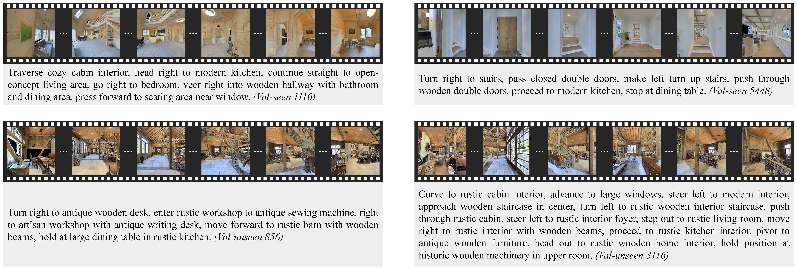

## Introduction
We're excited to release the code soon! Stay tuned for updates.

## Setup
### Requirements
Ensure that [Miniconda](https://docs.conda.io/en/latest/miniconda.html) is installed and this repository is cloned before proceeding.

Create and activate a Conda environment, then install dependencies:
```bash
conda create -n navc python=3.9
conda activate navc
pip install -r requirements.txt
```
All necessary packages will be installed after running these commands.
The program has been tested on Linux.

### Trajectory Data Preparation

This project organizes trajectory datasets using the following three-level folder structure:
`<dataset_folder>/<episode_folder>/<modality_folder>`.

For example, a pre-processed VLN-CE val-unseen dataset follows this format:
```
val_unseen/
    15/
        rgb/
            0_0.jpg
            1_0.jpg
            2_0.jpg
            ...
        inst/
            0.txt
            1.txt
            2.txt
        ...
    21/
    42/
    57/
    ...
```
Each episode folder can contain multiple modality subfolders:
+ `rgb/` (required) contains trajectory images in temporal order. Image filenames can use any naming convention, provided they remain in chronological order when sorted using [natsort](https://github.com/SethMMorton/natsort).
+ `depth/` (optional) contains corresponding depth images.
+ `action/` (optional) contains a single JSON file (`0.json`) with ground truth actions. The action labels are: 0: stop, 1: move forward, 2: turn left, 3: turn right.
+ `inst/` (optional) contains original instructions (if available) in text files.
+ `inst_<suffix>/` (generated) contains generated instructions and any intermediate information (if available). Instructions are stored in text files (e.g., `0.txt`), and semantic entities are stored in JSON files (e.g., `0.info`).
+ `action_<suffix>/` (generated) contains generated actions obtained by running action inference independently.
+ `key_frame/` (generated) contains key frame indices in `0.json` after key frame downsampling. This folder appears only when the run mode is set to keyframe.

Dataset and episode folder names are arbitrary—you can name them as you prefer.
To use customized trajectory datasets, ensure they follow the same structure.

### Pre-processed Data
Several pre-processed datasets used in our experiments are available for download:

[[vlnce_traj_action_clean_v1_val.zip]](https://pan.baidu.com/s/1qzhIiKPgf_5PDvoyN8Vx4g), [[various_traj_clean_release.zip]](https://pan.baidu.com/s/1OY5dUNcVWhVnFma62dMtkQ) (extraction code: navc)

We also provide generation results using two main variants: 

[[vlnce_traj_action_clean_v1_navcomposer.zip]](https://pan.baidu.com/s/1mQ94104fMLV0TemAqdBnaQ)

By default, all datasets and model weights are placed in the `data/` folder.
Therefore, it's recommended to download them into `data/` and then unzip them.
If extracted to a different location, update the corresponding path variables in the code.


### Extra Preparation
Running variants other than vo-qwn-qwn-qwn and contrastive matching evaluation requires additional setup:

+ ResNet50 module (rn) needs `data/model_weights/best_microsoft_resnet-50.pth`.
+ DINOv2 module (dn) needs `data/model_weights/best_dinov2_base.pth`.
+ MAE module (mae) needs `data/model_weights/mae_tune_vit_base.pth` and `data/model_weights/places365_cls_idx.json`.
+ SWAG module (swg) needs `data/model_weights/in_cls_idx.json`.
+ gpt, llm, gmm modules need authentication. Change corresponding api_key or hf_token in `tools/config.py`.
+ **Important**: Contrastive matcher needs `data/model_weights/cm.pth`, `data/model_weights/episodes_orders.json` and `data/model_weights/episodes_insts_orders.json`. These two JSON files ensure consistent batch ordering; otherwise, evaluation results may vary.

These files are also released:

[[model_weights.zip]](https://pan.baidu.com/s/1sdvjWi6-16s5fSK1sbWyXw)


## NavComposer

### Usage

The script `generation.sh` provides the simplest way to run NavComposer:
```
bash generation.sh /path/to/dataset
```
or more directly:
```
conda activate navc
torchrun main.py --config_file main.yaml run_folder=/path/to/dataset
```
This will generate three instructions for each trajectory, using the vo-qwn-qwn-qwn variant. The generated instructions will be saved in the `inst_navcomposer` folder with filenames `0.txt`,`1.txt`,`2.txt`.

`generation_full.sh` provides more options and examples.


### Module Customization
Our flexible framework makes it easy to include new module implementations.
Here are the steps:
1. Implement the module in a specific file. For example, implement the `Qwen2Object` class in the `object/qwen2_object.py`.
2. Import the module in the corresponding `object/__init__.py`. For example, add `from . import qwen2_object`.
3. Add a new configuration class in `tools/config.py`, for example, `Qwen2Config`.
4. Add a member instance of the configuration in the corresponding module config, for example, add `qwen2_config: Qwen2Config = Qwen2Config()` into `ObjectConfig`.
5. `Qwen2Object` can now be used by setting `object_config.name=Qwen2Object`.


## NavInstrCritic

### Usage

The script `evaluation.sh` provides the NavInstrCritic evaluation pipeline:
```
bash evaluation.sh all inst_navcomposer
```
This performs three types of evaluations on instructions with the alias 'inst_navcomposer'.
The corresponding programs are located in `tools/nav_instr_critic`.
Evaluation results will be placed in `data/speaker_evaluation`.

You may need to download NLTK models before evaluation:
```
python -c "import nltk; nltk.download('averaged_perceptron_tagger_eng'); nltk.download('punkt_tab')"
```

## Visualization



## Acknowledgements
Our research utilizes a variety of datasets in experiments: 
[VLN-CE](https://github.com/jacobkrantz/VLN-CE),
[HM3D](https://aihabitat.org/datasets/hm3d/),
[SceneNet](https://robotvault.bitbucket.io/scenenet-rgbd.html),
[GRUtopia](https://github.com/OpenRobotLab/GRUtopia/tree/main),
[SUN3D](https://sun3d.cs.princeton.edu/),
[ScanNet](http://www.scan-net.org/),
[TUM RGB-D](https://vision.in.tum.de/data/datasets/rgbd-dataset/download),
[12-Scenes](https://graphics.stanford.edu/projects/reloc),
[DIODE](https://diode-dataset.org/),
[KITTI](https://www.cvlibs.net/datasets/kitti/raw_data.php). 

Our research also leverages several open-source models: 
[ResNet50](https://huggingface.co/microsoft/resnet-50),
[DINOv2](https://huggingface.co/facebook/dinov2-base),
[MAE](https://github.com/facebookresearch/mae),
[SWAG](https://github.com/facebookresearch/SWAG),
[DETR](https://huggingface.co/facebook/detr-resnet-50),
[BLIP-2](https://huggingface.co/Salesforce/blip2-flan-t5-xl),
[Llama-3.1](https://www.llama.com/llama3_1/),
[LLaVA-1.6](https://github.com/haotian-liu/LLaVA),
[Gemma-2](https://huggingface.co/google/gemma-2-9b-it),
[Qwen2.5](https://github.com/QwenLM/Qwen2.5),
[Qwen2.5-VL](https://github.com/QwenLM/Qwen2.5-VL).

If you use these datasets or models, please ensure compliance with their respective agreements and licenses.